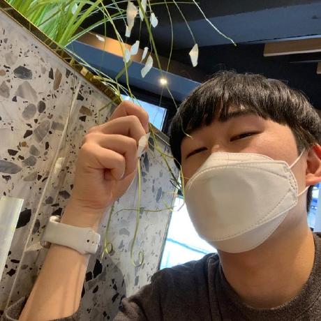

# dnd-7th-3-backend

## 💻 Developer

<div align="center">
<table>
  <tr>
      <td align="center"><a href="https://github.com/anjeongkyun"><br /><p><b>안정균</b></p></a><small>🍀 Back-End Developer</small></td>
    <td align="center"><a href="https://github.com/haeyonghahn"><br /><p><b>한해용</b></p></a><small>🍀 Back-End Developer</small></td>
    <td align="center"><a href="https://github.com/Amenable-C"><br /><p><b>최연재</b></p></a><small>🍀 Back-End Developer</small></td>
  </tr> 
</table>
</div>
<br><hr><br>

## 목차
* **[Architecture](#Architecture)**
* **[개발 환경](#개발-환경)**
* **[코딩 컨벤션](#코딩-컨벤션)**
* **[코드 포맷팅](#코드-포맷팅)**
* **[Git 컨벤션과 브랜치 전략](#Git-컨벤션과-브랜치-전략)**

<br><hr><br>

# Architecture


# 개발 환경
* Java 8
* Maven
* Spring Boot (v2.5.6)
* Spring Data JPA
* Spring Security
* Querydsl
* MariaDB
* jUnit
* github actions
* aws ec2, s3

# 코딩 컨벤션
## Naming
1. 변수는 CamelCase를 기본으로 한다.
- `userEmail`, `userCellPhone` ...
2. URL, 파일명 등은 kebab-case를 사용한다.
- `/user-email-page` ...
3. 패키지명은 단어가 달라지더라도 무조건 소문자를 사용한다.
- `frontend`, `useremail` ...
4. ENUM이나 상수는 대문자로 네이밍한다.
- `NORMAL_STATUS` ...
5. 함수명은 소문자로 시작하고 동사로 네이밍한다.
- `getUserId()`, `isNormal()` ...
6. 클래스명은 명사로 작성하고 UpperCamelCase를 사용한다.
- `UserEmail`, `Address` ...
7. 컬렉션은 복수형을 사용하거나 컬렉션을 명시해준다.
- `List ids`, `Map<User, Int> userToIdMap` ...
## Structure
1. 패키지는 목적별로 묶는다.
- `domain(domain 관련 패키지)`, `common(공통 관련 패키지)`
2. 하나의 메소드와 클래스는 하나의 목적을 두게 만든다.
- 하나의 메소드 안에서 한가지 일만 해야한다.
- 하나의 클래스 안에서는 같은 목적을 둔 코드들의 집합이여야한다.
## Programming
1. 반복되는 코드를 작성하지 않는다.
2. 변수는 최대한 사용하는 위치에 가깝게 사용한다.
3. 조건문에 부정조건을 넣는 것을 피한다.
```java
if(status.isNormal()) (O) / if(!status.isAbnormal()) (X)
```

# 코드 포맷팅
- tab size : 4
- indent : 4

# Git 컨벤션과 브랜치 전략
## 브랜치 이름
`브랜치타입/이슈ID`
- 브랜치를 생성하고나서 PR 이후 merge된 브랜치는 삭제한다.
## 브랜치 타입과 전략
- `main` : 배포 가능한 상태만을 관리
- `develop` : 해당 브랜치를 기반으로 개발을 진행하며 모든 기능이 추가되고 버그가 수정되어 배포 가능한 상태라면 'master' 브랜치에 merge
- `feature` : 새로운 기능 개발 및 버그 수정이 필요할 때마다 'develop' 브랜치로부터 분기
- `hotfix` : 배포한 버전에 긴급하게 수정을 해야 할 필요가 있을 경우, 'main' 브랜치에서 분기하는 브랜치


## 커밋 메시지
```
type: 내용
^--^  ^---^
|     |
|
+-------> Type: chore, docs, feat, fix, refactor, style, or test.
```
- `feat`: 새로운 기능 추가
- `fix`: 버그 수정
- `docs`: 문서 수정
- `style`: 코드 포맷팅, 세미콜론 누락, 코드 변경이 없는 경우
- `refactor`: 코드 리팩토링
- `test`: 테스트 코드, 리펙토링 테스트 코드 추가
- `chore`: 빌드 업무 수정, 의존성 파일 수정
